# 👋 Hi, I'm Brian Ngari

### Computer Science Student • Software Engineer in the Making • AI & Systems Enthusiast

<p align="center">
  
</p>

<p align="center">
  
</p>

> **I don't just want to learn how to use technology. I want to understand how it works.**

I'm a Computer Science student building toward software engineering through **projects, experimentation, and deliberate learning**.

I'm especially interested in **backend engineering, AI-powered systems, APIs, databases, networking, Linux, and software architecture**.

My approach is simple:

**Learn → Build → Break → Understand → Rebuild**

---

## 🔗 Let's Connect

<p align="center">

<a href="https://www.linkedin.com/in/brian-ngari-wambui/">
  
</a>

<a href="https://github.com/Mason-hun">
  
</a>

<a href="mailto:brianngari89@gmail.com">
  
</a>

</p>

---

## 🧠 About Me

I'm **Brian Ngari Wambui**, a Computer Science student with a growing obsession for understanding software beyond the surface.

My journey has moved from basic programming and web development into **backend systems, APIs, databases, artificial intelligence, networking, Linux, and software architecture**.

I'm particularly interested in the intersection between **AI and real-world software systems** — not just calling an API, but understanding the engineering pipeline underneath it.

### Currently

* 🎓 Pursuing a **BSc in Computer Science**
* 🤖 Exploring **AI engineering, LLMs, embeddings, semantic retrieval, and prompt engineering**
* ⚙️ Building backend systems with **Node.js, Express, and Python**
* 🧩 Strengthening **Data Structures & Algorithms and core Computer Science fundamentals**
* 🌐 Deepening my understanding of **Linux, UNIX, networking, and TCP/IP**
* ☁️ Exploring **cloud computing and modern infrastructure**
* 🚀 Turning learning into **real projects and working systems**

---

## 🛠️ What I Build

<table align="center">
<tr>

<td width="25%" align="center">

### 🤖 AI Engineering

LLM Integration
Prompt Engineering
Fact Extraction
Embeddings
Semantic Retrieval
Structured AI Outputs
AI Reasoning

</td>

<td width="25%" align="center">

### ⚙️ Backend & APIs

Node.js
Express
REST APIs
Python
PostgreSQL
System Architecture
Backend Services

</td>

<td width="25%" align="center">

### 🌐 Systems

Linux
UNIX
Networking
TCP/IP
Routing
Cloud Fundamentals
Distributed Systems

</td>

<td width="25%" align="center">

### 💻 Web Development

HTML
CSS
JavaScript
Bootstrap
Django
Next.js
Responsive Interfaces

</td>

</tr>
</table>

---

## 💻 Tech Stack

### Languages


### Backend & Databases


### AI & Data


### Tools & Infrastructure


---

## 🚀 Featured Projects

### 🤖 CanonSync AI

> **AI-powered continuity management for television writers' rooms.**

CanonSync AI acts like **version control for a show's canon**.

The system extracts established facts from submitted scenes, generates semantic embeddings, retrieves relevant canon using **PostgreSQL + pgvector**, and uses AI reasoning to identify potential contradictions.

### My Contribution

I worked primarily on the **AI engineering side**, including:

* 🧠 LLM/provider architecture
* 🤖 IBM Granite integration
* 🔍 Fact extraction
* 🧩 Contradiction analysis
* ✍️ Prompt engineering
* 📦 Structured AI outputs
* 🔎 Semantic retrieval and embeddings
* ⚙️ AI pipeline orchestration

**Stack:** `Node.js` `Express` `PostgreSQL` `pgvector` `IBM Granite` `Next.js`

[](https://github.com/kevinmasanga/canonsync-ai)

---

### 🏥 Northstar Support Deflection MVP

An AI-oriented support system prototype exploring how intelligent information retrieval and response workflows can reduce repetitive customer-support workloads.

**Stack:** `JavaScript` `Node.js` `APIs`

[](https://github.com/Mason-hun/northstar-support-deflection-mvp)

---

### 🐍 Northstar RabbitMQ Python

An independent learning project exploring **Python, RabbitMQ, messaging systems, and asynchronous communication**.

Built while deepening my understanding of backend architecture and distributed systems.

**Stack:** `Python` `RabbitMQ`

[](https://github.com/Mason-hun/northstar-rabbitmq-python)

---

### 🌐 Developer Dashboard

A web-based developer dashboard built while strengthening my frontend development foundations.

**Stack:** `HTML` `CSS` `JavaScript`

[](https://github.com/Mason-hun/developer-dashboard)

---

## 🧪 Currently Building & Learning

<p align="center">
  
</p>

```text
                     ┌─────────────────────────┐
                     │   SOFTWARE ENGINEER     │
                     │       IN THE MAKING     │
                     └────────────┬────────────┘
                                  │
              ┌───────────────────┼───────────────────┐
              │                   │                   │
              ▼                   ▼                   ▼
       🤖 AI ENGINEERING    ⚙️ BACKEND SYSTEMS    🌐 SYSTEMS
              │                   │                   │
            LLMs                APIs                Linux
         Embeddings          Databases           Networking
             RAG             Architecture           Cloud
        AI Reasoning      Distributed Systems   Infrastructure
```

<p align="center">
  <i>Learning by building things that force me to understand what is underneath.</i>
</p>

---

## 🧠 Learning Philosophy

<p align="center">
  <b>Learn → Build → Break → Understand → Rebuild</b>
</p>

I don't want to merely memorize how things work.

I want to understand **why** they work.

That means going beyond tutorials, questioning abstractions, debugging deliberately, building mental models, and turning knowledge into working systems.

---

## 📚 Learning Journey

I'm building breadth while strengthening the fundamentals that make good software engineering possible.

### 🧠 Computer Science

* Data Structures & Algorithms
* Object-Oriented Programming
* Database Systems
* Automata Theory
* Software Architecture
* API Design
* Computer Networks

### 🤖 Artificial Intelligence

* Prompt Engineering
* LLM Integration
* Structured Outputs
* Embeddings
* Semantic Search
* Retrieval Pipelines
* AI-Assisted Development

### 🌐 Infrastructure & Systems

* UNIX / Linux
* Networking
* Routing
* Cloud Computing
* APIs
* Distributed Systems

---

## 🏆 Programs & Technical Communities

My learning journey has included technical programs and communities such as:

* **IBM SkillsBuild**
* **Power Learn Project**
* **Internet Society**
* **eMobilis**
* **OctoPrep**
* **Fortinet**
* **Microsoft Azure AI**
* **Tech4Africans**

I'm less interested in collecting certificates and more interested in **what I can actually build with what I learned.**

---


## 📊 GitHub Activity

<p align="center">
  
  
</p>


---

## 🐍 Contribution Journey

<p align="center">
  <i>One commit at a time.</i>
</p>

<p align="center">
  <picture>
    <source media="(prefers-color-scheme: dark)" srcset="https://raw.githubusercontent.com/Mason-hun/Mason-hun/gh-pages/github-contribution-grid-snake-dark.svg">
    <source media="(prefers-color-scheme: light)" srcset="https://raw.githubusercontent.com/Mason-hun/Mason-hun/gh-pages/github-contribution-grid-snake.svg">
    
  </picture>
</p>

---

## ⚡ A Little More About Me

<p align="center">

🎓 Computer Science student
🇰🇪 Building from Kenya
🧠 Curious by default
📚 Slightly obsessed with learning
🤖 AI enthusiast
⚙️ Systems nerd in progress
🌐 Backend & infrastructure curious
🚀 Builder before collector

</p>

<p align="center">
  <i>
    Don't aim to know everything.<br>
    Aim to understand whatever you choose to learn deeply.
  </i>
</p>

---

## 🌱 What's Next?

I'm building toward becoming a **deeply capable software engineer**.

I want to become the kind of engineer who can move comfortably from:

<p align="center">

**problem → architecture → code → database → API → deployment → debugging**

</p>

The long game is **technical depth, strong fundamentals, meaningful projects, and becoming genuinely useful**.

Not just someone who can make things look good.

Someone who understands what is happening underneath.

---

<p align="center">
  <b>👋 Thanks for stopping by.</b>
  <br><br>
  <i>If you're building something interesting, let's build. 🚀</i>
</p>
